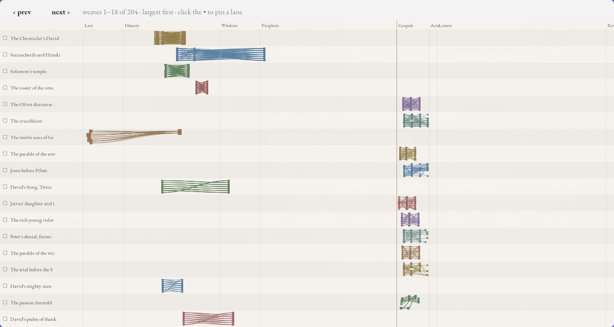

# pure-study

A KJV-only Bible-study tool: a clean parallel-passage reader with an optional
"Full study" tier of Strong's, morphology, cross-references, and corpus
analytics. Built in Rust; successor to *overlay*. Everything runs locally and
offline — the repo ships the complete data pack, so a clone is a working app.


## Install & run

### Windows

Download the zip for your architecture (arm64 / x64 / x86) from the
[Releases page](https://github.com/glendonjklassen/pure-study/releases) —
self-contained, data pack bundled. Unzip anywhere and run `PureStudyWin.exe`;
no installer, no runtime to install. (The build is unsigned for now, so
SmartScreen may ask once — "More info → Run anyway".)

### Linux (from source)

The GUI is GTK4 + libadwaita. You need the Rust toolchain
([rustup](https://rustup.rs)) and the GTK development packages:

```sh
# Arch:            sudo pacman -S gtk4 libadwaita
# Debian/Ubuntu:   sudo apt install libgtk-4-dev libadwaita-1-dev build-essential
# Fedora:          sudo dnf install gtk4-devel libadwaita-devel

git clone https://github.com/glendonjklassen/pure-study.git
cd pure-study
cargo run --release -p pure-desktop
```

That's it — the checkout itself is a hydrated data home (KJV text, Strong's,
weaves, the full analytics pack), so everything lights up on first launch.
There is no Linux package yet (AppImage/flatpak/AUR are planned); on Linux,
building from source is currently the only path.

To run the app from anywhere (not just the checkout), seed a per-user home
once — `~/.local/share/pure-study` on Linux — and the binary will find it:

```sh
cargo run --release -p pure-hydrate -- copy --from . --to ~/.local/share/pure-study
```

## First run

You'll be asked **Simple reader** or **Full study**:

- **Simple** is just the text: panes, navigation, search, margin notes.
- **Full study** adds the whole study surface — Strong's word study, the
  analytics tiers, weave authoring, threads, tags.

The choice is saved and can be flipped any time with the button in the header.
The reader reopens wherever you left off. See **[docs/GUIDE.md](docs/GUIDE.md)**
for the full tour — search syntax, the study panel explained tier by tier,
weaves, the constellation, threads and tags.

## Shortcuts

The reading pane holds focus (click it if a dropdown steals it):

| Key | Action |
|-----|--------|
| `Up` / `Down` | scroll a few lines |
| `PageUp` / `PageDown` / `Space` | scroll nearly a page |
| `Home` / `End` | chapter start / end |
| `Left` / `Right` (or `[` / `]`) | step chapters, rolling across book boundaries |
| **`Shift`** + wheel / `Up` / `Down` / `PageUp` / `PageDown` / `Space` | **lock every pane together** (parallel reading) |
| `Ctrl` + wheel, `Ctrl` `+` / `-` | zoom the body text · `Ctrl 0` resets |
| `Ctrl`+click a word (or double-click) | open its Strong's study panel |
| `Esc` | close the study panel / any popup (clicking outside a popup also closes it) |

## Weaves — parallel passages

A **weave** ties parallel passages together (a Gospel harmony, a prophecy and
its fulfillment, an OT verse and the NT that quotes it). Links are **ambient**:
point two panes at parallel passages and any weave connecting them draws its
connector lines across the gap — no mode to enter. A verse scrolled out of view
leaves its connector pinned at the pane edge as a hint.

- **Map** — book-to-book weave density as chord ribbons.
- **Constellation** — the whole weave library, one weave per labelled lane on
  the canon backbone; page with `‹ ›` (or `Left`/`Right`), **pin** a lane
  (click its `▪`) to hold it while paging others past it, click a node to jump
  there, an edge to open the weave.



> [!NOTE]
> The weaves shipped in this repo began life as **AI-generated study aids**.
> Each records an `approved` flag, surfaced in the reader; approving one (from
> its compare card) is how a parallel graduates from a study prompt to
> something you've checked against the text yourself.

## Your data

Everything lives under one **data home** — the first of: `$PURE_STUDY_HOME` /
`$OVERLAY_HOME`, a directory tree containing `data/kjv.jsonl` (this checkout
counts), the executable's directory, or the per-user data dir
(`~/.local/share/pure-study` on Linux, `%APPDATA%\pure-study` on Windows).

Yours to back up: `weaves/`, `threads/`, `tags/`, `patches/` in the data home,
plus the config (`~/.config/pure-study/config.json`). The rest (`data/`,
`bridge/`, `*.idxcache`) is the shipped/regenerable pack. All writes are
atomic (temp → fsync → rename), on every platform.

## Limitations, honestly

- **KJV-only, by design.** The analytics ride the 1769 tokenization end to end.
- **Linux and Windows today.** The GTK (Linux) and WinUI (Windows) shells are
  at feature parity over the same Rust core
  ([docs/FEATURE-MANIFEST.md](docs/FEATURE-MANIFEST.md) is the parity
  contract); Android (Compose) and macOS shells are planned — see
  [TODO.md](TODO.md).
- **No sync.** One machine, one home; copy the authored dirs to move.
- **Grammar search** (`tense:aorist`-style form predicates) is a placeholder —
  word/phrase/reference/Strong's-code search all work (see the guide).
- Cross-testament **quotation detection** is not ported (its curated output
  ships in the bridge data); the suggested-parallels *generator* is offline
  tooling — the reader consumes its results.

## Data provenance

The KJV text (public domain) comes via eBible.org's SWORD module; Strong's via
Open Scriptures (CC-BY-SA); morphology from OSHB (CC-BY 4.0) and Robinson's
public-domain Textus Receptus tagging; cross-references from the TSK via
openbible.info. Full credits and licenses: **[BIBLIOGRAPHY.md](BIBLIOGRAPHY.md)**.
Scripture renders in EB Garamond (OFL, bundled).

## For developers

| Crate | What it is |
|-------|------------|
| `crates/core` | Pure domain: corpus, Strong's, search, weaves, tags, config, atomic store |
| `crates/layout` | Greedy line-breaker + hit regions (measures via callback) |
| `crates/rnd` | Feature-gated analytics: bridge, embeddings, morphology, keyness, witness, concept |
| `crates/ffi` | The single flat C ABI for native shells (cdylib) — see [crates/ffi/README.md](crates/ffi/README.md) |
| `crates/hydrate` | `pure-hydrate` CLI: copy/verify the data pack into a home |
| `apps/desktop` | The GTK4 + libadwaita shell (Linux) |
| `apps/windows` | The WinUI 3 + Win2D shell (Windows) — see [its README](apps/windows/PureStudyWin/README.md) |

```sh
cargo test -p pure-core -p pure-layout -p pure-rnd -p pure-ffi -p pure-hydrate
cargo test -p pure-rnd --features "bridge embeddings morphology concept"
```

The five portable crates are dependency-light pure Rust and build on Linux,
macOS, and Windows including ARM64 (`aarch64-pc-windows-msvc` — on the ARM box:
VS Build Tools C++ workload, then `cargo build --release -p pure-ffi` →
`pure_ffi.dll` + the committed C header / C# P/Invoke shim). CI runs the
portable tests, the R&D-feature tests, an FFI binding-drift guard, and Windows
x86_64 + ARM64 cross-builds of the C ABI on every push. The offline pipeline
that produced the data pack is documented in
[data-prep/README.md](data-prep/README.md); porting history in
[PROGRESS.md](PROGRESS.md) and [PLAN.md](PLAN.md).
